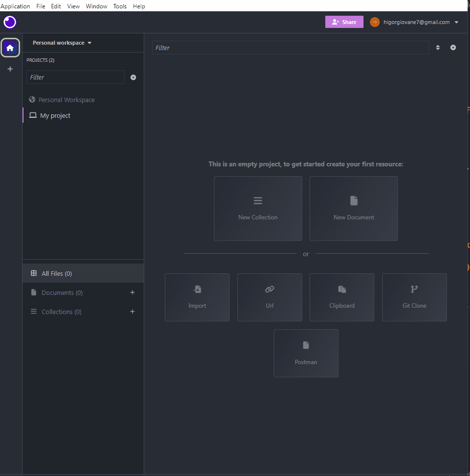

#  🚧 Desafio Técnico Backend 2

Esse é um projeto de criação de uma API RESTfull, utilizando as tecnologias principais o Node.js, Express.js, MongoDB, Mongoose,JWT, Jest, Gulp e JsHint, hospedado no Render.com e no Railway.app.

## ⚙ Proposta

Desenvolver uma API RESTful para autenticação de usuários, que permita operações de cadastro (sign up),
autenticação (sign in) e recuperação de informações do usuário.

## 💻 Documentação da API

### - Cadastro de usuário -

```http
  POST /usuario/cadastro
```
#### Headers da requisição
| Header   | Valor       | Descrição                           |
| :---------- | :--------- | :---------------------------------- |
| `-` | `-` | `-` |

#### Body da requisição
| Parâmetro   | Tipo       | Descrição                           |
| :---------- | :--------- | :---------------------------------- |
| `nome` | `string` | **Obrigatório**.  |
| `email` | `string` | **Obrigatório**. |
| `senha` | `string` | **Obrigatório**.  |
| `telefones` | `array` | **Obrigatório**. Deve ser do tipo: {"numero": string, "ddd": string} |

#### ✅ SUCESSO ✅ - Retorna os dados do  usuário cadastrado (id, data da criação, data de atualização, ultimo login e um token).

#### ❌ ERRO ❌ - Caso tenha um e-mail já cadastrado igual ao que o usuário informou no cadastro, a menasgem a seguir é exibida: { mensagem: 'E-mail já existente.' }

### - Login de usuário -

```http
  POST /usuario/login
```
#### Headers da requisição
| Header   | Valor       | Descrição                           |
| :---------- | :--------- | :---------------------------------- |
| `-` | `-` | `-` |

#### Body da requisição
| Parâmetro   | Tipo       | Descrição                                   |
| :---------- | :--------- | :------------------------------------------ |
| `email`      | `string` | **Obrigatório**. Email cadastrado anteriormente |
| `senha`      | `string` | **Obrigatório**. Senha cadastrada anteriormente |

#### ✅ SUCESSO ✅ - Retorna os dados do  usuário cadastrado (id, data da criação, data de atualização, ultimo login e um token).

#### ❌ ERRO ❌ - Caso tenha um e-mail já cadastrado igual ao que o usuário informou no cadastro, a menasgem a seguir é exibida: { mensagem: 'E-mail já existente.' }

### - Busca de usuário -

```http
  GET /usuarios/buscar
```
#### Headers da requisição
| Header   | Valor       | Descrição                                   |
| :---------- | :--------- |:------------------------------------------ |
| `Authentication` | `Bearer {token}` | Token do usuário |

#### Body da requisição

| Parâmetro   | Tipo       | Descrição                                   |
| :---------- | :--------- | :------------------------------------------ |
| `-` | `-` | `-` |

#### ✅ SUCESSO ✅ - Retorna os dados do  usuário cadastrado (id, data da criação, data de atualização, ultimo login e o token).

#### ❌ ERRO ❌ - Caso não tenha o token, erro: { mensagem: 'Não autorizado - Token não fornecido' }

#### ❌ ERRO ❌ - Caso o token tenha passado de seu tempo: { mensagem: 'Sessão inválida - Token expirado' }

#### ❌ ERRO ❌ - Caso o token não seja válido: { mensagem: 'Não autorizado - Token inválido' }

## 🐛 Importando e testando API

### Importando a API, que está disponivel no [Drive](https://drive.google.com/drive/folders/1FLv0MGlkyu1PcFFSJzuwMbBWqXNcA3Nc?usp=sharing).



### Testando API, em todas suas rotas e casos que podem acontecer.


## 🎯 Requisitos atendidos
- [x]  Persistência de dados
- [x]  Sistema de build com gerenciamento de dependências.
- [x]  Task runner para build.
- [x]  Padronização de estilo (ex: jsHint/jsLint).
- [x]  Framework: Express, Hapi, ou similar.
- [x]  JWT como token.
- [x]  Testes unitários.
- [x]  Criptografia hash na senha e token.


## 📦 Deploy

Deploy realizado no [Render](https://render.com/) e também na [Railway](https://railway.app/), com a finalidade de evitar adversidades.

API rodando na URL: https://crud-estribo.onrender.com/ e também na https://crudescribo.up.railway.app/

Exemplo de utilização: https://crud-estribo.onrender.com/usuario/cadastro ou https://crudescribo.up.railway.app/usuario/cadastro

O cabeçalho (header) e o corpo (body) da requisição devem ser fornecidos para realizar a solicitação. As solicitações podem ser testadas por meio de um framework para desenvolvimento/teste de API Clients. O Postman e o Insomnia são dois ótimos exemplos. Para este caso, utilizei o Insomnia. O arquivo de importação no insomnia para realizar os testes está no [Drive](https://drive.google.com/drive/folders/1FLv0MGlkyu1PcFFSJzuwMbBWqXNcA3Nc?usp=sharing) tanto para a URL do Railway quanto Render.

## Licença

[MIT](https://choosealicense.com/licenses/mit/)
